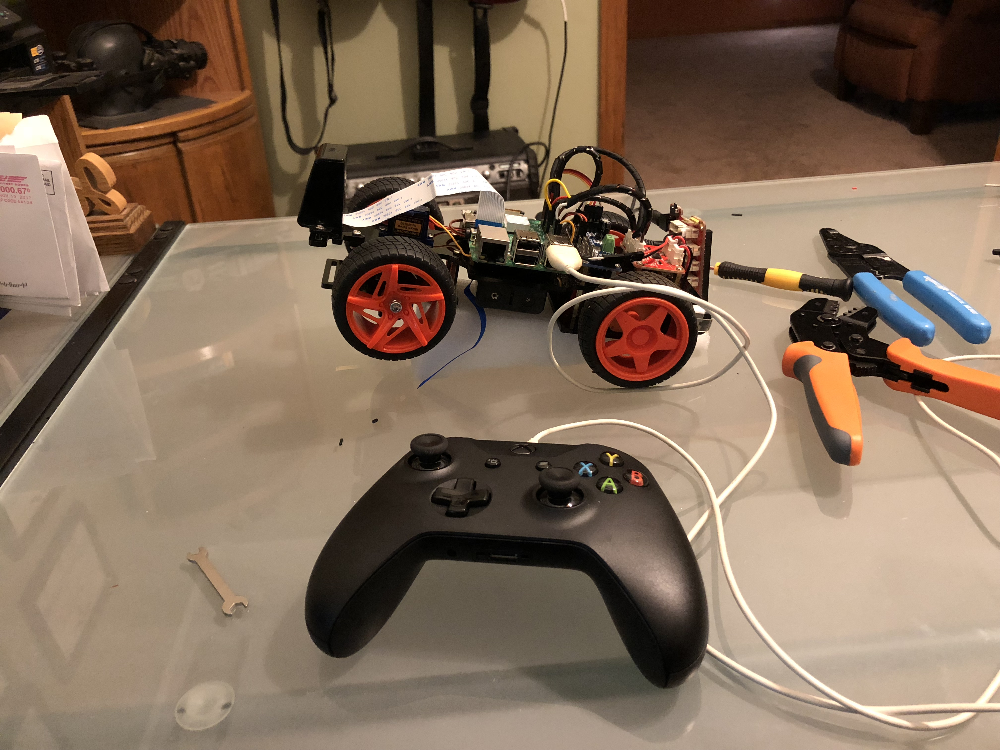
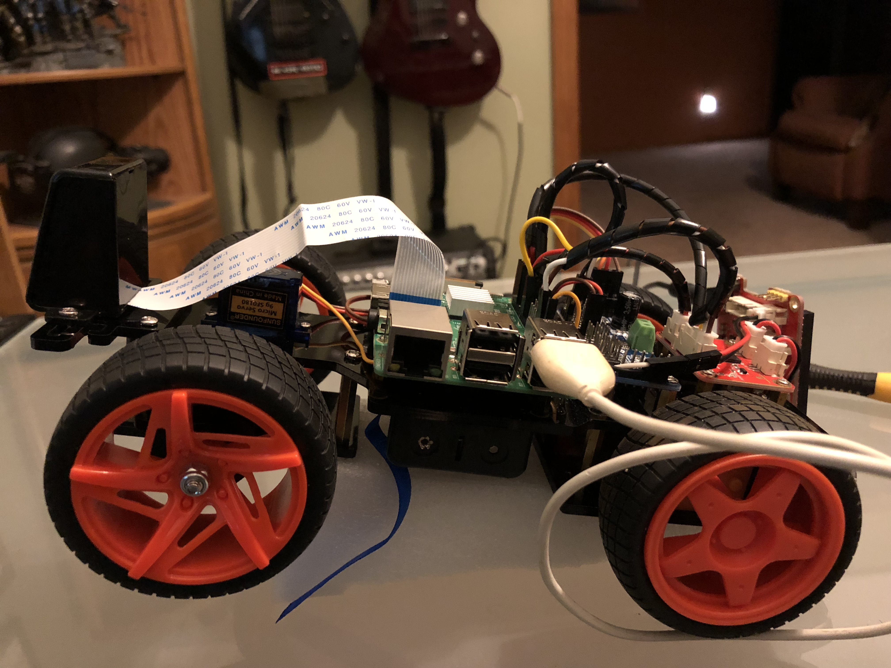

## Welcome to Tanis, my self-driving R/C car.

I graduated from Udacity's Self-Driving Car Engineer Nanodegree in November of 2017. Once I graduated I wanted to put my skills to the test and build my own self-driving car.  Since I figured it would be dangerous to start messing with my actual car, I decided to build a self-driving R/C car.  

My goals for this project were simple.  
- Project costs below $200
- Car must be able to navigate any track using a black 'street' and yellow and white lane lines
- Car must avoid obstacles
- Car must be able to pass other slow moving cars
- Maintain position at the center of the lane
- Everything runs on the Raspberry pi.

To begin the project, I bought a Sunfounder Pi-Car-S on [ Amazon ]( https://www.amazon.com/SunFounder-Raspberry-Smart-Robot-Car/dp/B06XYZRBNJ )

I did some research and found [ Donkey Car ]( http://www.donkeycar.com/ ) which I thought would make a good code base to control the car.  However I found trying to tap into the Donkey Car program rather difficult.  Since I like to know how things work, I decided this would be a great opportunity. I started researching how the RaspberryPi sent signals to the pins (GPIO) and how to do pulse width modulation to control the servo for the steering.  This allowed me to write the 2 initial classes I needed to get this running, motormove.py and steer.py.  These provide the basic controls to move the car forward and backward, stop the car, and steer the car.  

Once these were built and tested, it was time to get ROS running on the car.  I was able to find some guides for installing ROS Kinetic Kame on a raspberryPi, and I was able to update the guide to install ROS Lunar loggerhead.

### TODO list
- Hardware out layer (Needs testing with ROS)
    - Steering (Done)
    - Vehicle Movement (Done)
- ROS
    - messages and services, allows all nodes to communicate.
- Hardware in layer 
    - image capture from camera at 10hz.  Adjustable based on performance.
- Control Layer
    - Lane Keeping (behavioral cloning)
    - Lane Change
    - Obstacle Detection (vehicle detectiuon with HOG and a linear SVM Classifier)
    - Path Planning

### Why is the car names Tanis, and the ROS package called Angela?
I highly suggest you read the book series [ Aeon 14 ](http://www.aeon14.com/).  Tanis Richards is the protagonist of the series, and has become one of my all time favorite characters.

### Nov 15
I think I will keep a running commentary here.  Today I was able to get ROS installed and running on my Raspberry Pi. With ROS running, i decided it was time to update the code to use topics and messages.  I created a few message types to test steering and speed and set up the appropriate topics.  After a few hours of tweaking my code, I was able to successfully use ROS to pass messages between a testing node and the motormove node.  The steering node is giving me some TCP/IP issues so I will look in to that tomorrow.  Overall, it was a pretty productive day!!

### Nov 19th
Wrote the initial controller interface so I can control the car with an XBox One controller.  This will be paramount for the behaviorial cloning part of this project.


### Nov 24th
Did some work on the wiring for the car today.  Built new jumpers for the boards and made everything look a little bit cleaner.  Once that was done it was back to work on controlling the car.  It took me awhile to determine how to get joystick values from the controller.  There are no tutorials for evdev out there which show an easy way to do it.  This meant I had to do a few hours of testing and digging through what was available in the code.  I was finally able to get good values from the sticks and was able to convert them into how much the car should be turning.  Everything is working good now.  Well, kinda.  For some reason every few minutes the controller disconnects and the raspberry pi crashes.  Because it is a hard crash, there is no debug info I have found to tell me what is happening.  Best I can tell when the controller is receiving too much input, something goes wonky and the whole thing goes down.  During my testing I saw the controller was extremely sensitive, it would be sending signals from the sticks while it just sat there.  I may have to go ahead and configure some deadzones and get the controller working a bit better.  Until then, here are some images of Tanis from today after I cleaned up all the wiring. 




### Jan 20th - Tanis is driving!
But not on her own...

Back after an extended break.  I took some time away from the project for a while since I had hit some roadblocks and wanted to take a step back.  I was having all kinds of issues getting the steering smooth.  As I found out, you can use the Raspberry Pi GPIO to send a PWM (Pulse Width Modulation) signal.  Unfortunately that signal is dirty.  Which meant I was not getting clean steerning.  It was real jerky and couldnt seem to catch up.  I ended up using a PCA9685 PWM module to control the signals.  Turned out it was fairly easy to set up and there were even some basic 'drivers' written for the it.  This made it a lot easier as the drivers could handle the calculations required to generate the signal.  I just had to turn my steering degrees into a usable signal.  The Xbox one controller puts out a numeric value, from approx 32000 to -32000,  corresponding to the position of the joystick on the X axis.  I had to turn into a usable value from 0 to 100, After a lot of trial and error i was able to come up with the following:
```python
    self.turningValue = 90 + int(absevent.event.value / 1050) 
```

Once this was done, this message is passed along in the steermsg to the turn_input node.  This node then take the value, divides by 18 and adds 2 which turns it into a value from 1-10 which corresponds to the approx 120 degree arc the wheels can turn.

Calibrating Tanis' steering


Because of the errors trying to get a smooth turn, I ended up splitting the turning and the speed inputs into two separate scripts.  I found if they were in one script it was unable to read the events fast enough and often times the events would step all over themselves resulting in very erratic behaivor.

Now that I am able to control the vehicle with a reasonable degree of accuracy, it is time to start capturing data in order to build my training and test sets for the behaviorial cloning section. I wanted to use OpenCV to manipulate the images so I began installing it on the Raspberry Pi.

When I was done installing, somehow the GUI had disappeared.  This wouldnt be a problem except for the fact you need multiple terminal windows to run ROS.  Once I am done reformatting the card and getting everything installed, it will be backed up so I dont have to deal with getting everything installed!

While all that is going on, I began to sketch out the system map.


