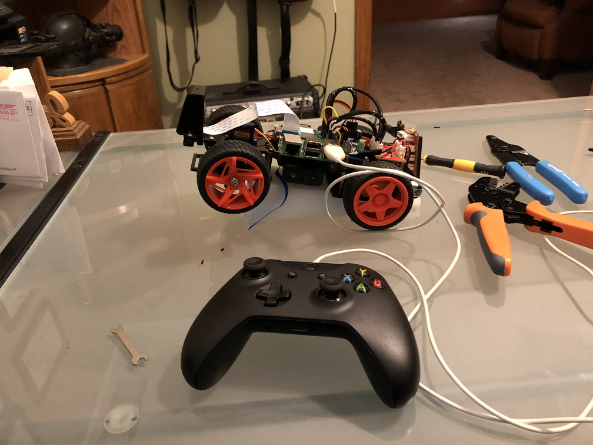

## Welcome to Tanis, my self-driving R/C car.

I graduated from Udacity's Self-Driving Car Engineer Nanodegree in November of 2017. Once I graduated I wanted to put my skills to the test and build my own self-driving car.  Since I figured it would be dangerous to start messing with my actual car, I decided to build a self-driving R/C car.  

My goals for this project were simple.  
- Project costs below $200
- Car must be able to navigate any track using a black 'street' and yellow and white lane lines
- Car must avoid obstacles
- Car must be able to pass other slow moving cars
- Maintain position at the center of the lane
- Everything runs on the Raspberry pi.

To begin the project, I bought a Sunfounder Pi-Car-S on [ Amazon ]( https://www.amazon.com/SunFounder-Raspberry-Smart-Robot-Car/dp/B06XYZRBNJ )

I did some research and found [ Donkey Car ]( http://www.donkeycar.com/ ) which I thought would make a good code base to control the car.  However I found trying to tap into the Donkey Car program rather difficult.  Since I like to know how things work, I decided this would be a great opportunity. I started researching how the RaspberryPi sent signals to the pins (GPIO) and how to do pulse width modulation to control the servo for the steering.  This allowed me to write the 2 initial classes I needed to get this running, motormove.py and steer.py.  These provide the basic controls to move the car forward and backward, stop the car, and steer the car.  

Once these were built and tested, it was time to get ROS running on the car.  I was able to find some guides for installing ROS Kinetic Kame on a raspberryPi, and I was able to update the guide to install ROS Lunar loggerhead.

### TODO list
- Hardware out layer 
    - Steering (Done)
    - Vehicle Movement (Done)
    - Tested with ROS (PASS)
- ROS
    - messages and services, allows all nodes to communicate. (Working)
- Hardware in layer 
    - image capture from camera at 10hz.  Adjustable based on performance.
- Control Layer
    - Lane Keeping (behavioral cloning)
    - Lane Change
    - Obstacle Detection (vehicle detectiuon with HOG and a linear SVM Classifier)
    - Path Planning

### Why is the car names Tanis, and the ROS package called Angela?
If you like reading hard Science Fiction, then I highly suggest my all time favorite series: [ Aeon 14 ](http://www.aeon14.com/).  Tanis Richards is the protagonist of the series, and has become one of my all time favorite characters. Angela is the name of her partner AI, so I thought it was cool to name the car after Tanis, and the computer doing all the calculations after Angela.  The car itself and all of it's components are Tanis.  But the underlying control and brains is Angela.  

### Nov 15
I think I will keep a running commentary here.  Today I was able to get ROS installed and running on my Raspberry Pi. With ROS running, i decided it was time to update the code to use topics and messages.  I created a few message types to test steering and speed and set up the appropriate topics.  After a few hours of tweaking my code, I was able to successfully use ROS to pass messages between a testing node and the motormove node.  The steering node is giving me some TCP/IP issues so I will look in to that tomorrow.  Overall, it was a pretty productive day!!

### Nov 19th
Wrote the initial controller interface so I can control the car with an XBox One controller.  This will be paramount for the behaviorial cloning part of this project.


### Nov 24th
Did some work on the wiring for the car today.  Built new jumpers for the boards and made everything look a little bit cleaner.  Once that was done it was back to work on controlling the car.  It took me awhile to determine how to get joystick values from the controller.  There are no tutorials for evdev out there which show an easy way to do it.  This meant I had to do a few hours of testing and digging through what was available in the code.  I was finally able to get good values from the sticks and was able to convert them into how much the car should be turning.  Everything is working good now.  Well, kinda.  For some reason every few minutes the controller disconnects and the raspberry pi crashes.  Because it is a hard crash, there is no debug info I have found to tell me what is happening.  Best I can tell when the controller is receiving too much input, something goes wonky and the whole thing goes down.  During my testing I saw the controller was extremely sensitive, it would be sending signals from the sticks while it just sat there.  I may have to go ahead and configure some deadzones and get the controller working a bit better.  Until then, here are some images of Tanis from today after I cleaned up all the wiring. 




### Jan 20th - Tanis is driving!
But not on her own...

Back after an extended break.  I took some time away from the project for a while since I had hit some roadblocks and wanted to take a step back.  I was having all kinds of issues getting the steering smooth.  As I found out, you can use the Raspberry Pi GPIO to send a PWM (Pulse Width Modulation) signal.  Unfortunately that signal is dirty.  Which meant I was not getting clean steerning.  It was real jerky and couldnt seem to catch up.  I ended up using a PCA9685 PWM module to control the signals.  Turned out it was fairly easy to set up and there were even some basic 'drivers' written for the it.  This made it a lot easier as the drivers could handle the calculations required to generate the signal.  I just had to turn my steering degrees into a usable signal.  The Xbox one controller puts out a numeric value, from approx 32000 to -32000,  corresponding to the position of the joystick on the X axis.  I had to turn into a usable value from 0 to 100, After a lot of trial and error i was able to come up with the following:
```python
    self.turningValue = 90 + int(absevent.event.value / 1050) 
```

Once this was done, this message is passed along in the steermsg to the turn_input node.  This node then take the value, divides by 18 and adds 2 which turns it into a value from 1-10 which corresponds to the approx 120 degree arc the wheels can turn.

Calibrating Tanis' steering


Because of the errors trying to get a smooth turn, I ended up splitting the turning and the speed inputs into two separate scripts.  I found if they were in one script it was unable to read the events fast enough and often times the events would step all over themselves resulting in very erratic behaivor.

Now that I am able to control the vehicle with a reasonable degree of accuracy, it is time to start capturing data in order to build my training and test sets for the behaviorial cloning section. I wanted to use OpenCV to manipulate the images so I began installing it on the Raspberry Pi.

When I was done installing, somehow the GUI had disappeared.  This wouldnt be a problem except for the fact you need multiple terminal windows to run ROS.  Once I am done reformatting the card and getting everything installed, it will be backed up so I dont have to deal with getting everything installed!

While all that is going on, I began to sketch out the system map.


### Feb 3rd

Found out my camera on the pi was bad.  Not sure what happened, but I think the cable got crimped.  Fragile little things.  Anyways, new cameras (bought backups) arrived yesterday so I got right back to work on Tanis today.  I was able to get the camera up and running and was able to capture images.  Once I was able to capture images I needed to convert them to a format the built in ROS 'sensor_msgs/Image' message type so I can pass the input to a module.  Luckily there is a tool for that CV_Bridge().  This is a python asspebly (I am sure there is a c++ one out there also) which performs the reformating of the image from an OpenCV image to a ROS image.  I still want to find a better way to do this, as my workflow looks like this:  capture OpenCV Image --> convert to ROS message image type --> convert back to OpenCV image so it can be manipulated.  But I was able to get image messages passed back and forth between nodes, although the color is way off.  I think I just need to specify the encoding, but my image manipulation is a bit rusty for now.  I also found I need to adjust the shutter speed on the camera as the pictures are very blurry when the vehicle is moving.  I may even switch to a video stream and then just grab single images from the stream.  That may be a good route to go since ROS allows you to set a rate, so I could probably just make a 10 Hz (the car goes so slow i dont think i need faster) node to grab an image from the stream.  I also adjusted the sample rate for the turning inputs.  I was grabbing the inputs at 20 Hz but the steering was pretty sketchy.  It would jump all over the place.  So I bumped the sample rate to 50 Hz and saw no improvement.  Then I set the rate to 10 Hz and it cleaned up a bit. I ended up using a sample rate of 5 Hz and the steering is much much smoother.  

With all of that being said, I am getting pretty close to the fun parts of the project.  Since the camera is working, and just needs a minor tweak for the color being off, I can start capturing images on the track which I can feed into my behaivorial cloning module.  I plan on capturing images from a few laps around the track, and then feed them into a behaivorial cloning neural network I made during school.  I'll do all the heavy training of the network on my laptop and save a completed model of the network out, which I can then use on Tanis to run the images through.  

Before I start doing that I need to fix the camera issue and fix an issue with the vehicle pulling to the right.  Should be a simple adjustment to the center PWM value. But once those are done, time to start training! 

### Feb 24

Well, I was able to take Tanis for a drive today.  I spent a few hours cleaning up the code a bit and working on some small issues.  I was able to get the color corrected on the camera, and implemented an offset for the steering so it would stop pulling to the side.  The images are still a bit blurry, even after switching to a video stream running at 30 fps, and capturing each frame individually.  I am thinking it may be a bit better when I get the track made.  As it is, I am grabbing the images, and writing the corresponding steering angle to a csv file.  I will use this to capture the training data I will use to teach Angela how to drive.  I am going to work on building the track tomorrow and maybe capturing some video while driving around it.  My goal is somewhere around 40,000 images to use.  

In school we were usually working with datasets containing around 30,000 images.  Capturing that many images would require I drove around the track for about 22 minutes (at 30 fps).  I dont plan on doing that though.  I plan on maybe one trip around the track in each direction. Once I get that set of images, then I will do some image manipulation to rotate some of the images, adjust the brightness, and some other cool tricks where the same image will be used 4-5 times and look different to the neural network each time.  If I have enough of a training set I will start working the neural network.  

I adapted the Behaivorial Cloning neural network for use with Tanis, tomorrow I will see if it actually works :) Unti then, here is Tanis chasing my Boxer, Muzay.
